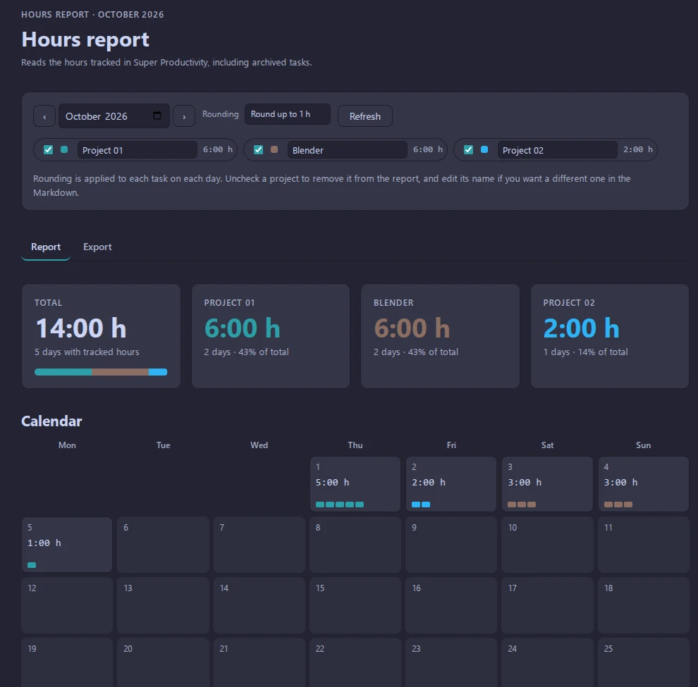
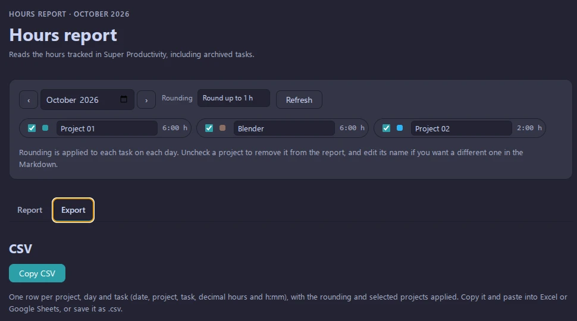

# SP Hours Report

A [Super Productivity](https://super-productivity.com) plugin that sums the month's tracked hours by project and task, and generates a Markdown report you can copy anywhere.

## Features

- Reads tracked time from active **and archived** tasks.
- Month picker and rounding (none, 15 min, 30 min, 1 h, always rounded up per task per day).
- Include or exclude projects and rename them for the report.
- **Report** tab: totals, calendar, weekly breakdown and per-project task and daily detail.
- **Export** tab:
  - Markdown (English) with a live preview. Edit it and the totals recalculate.
  - Plain-text version without tables, for chats and editors that don't render them (Discord, Slack, etc.).
  - CSV, grouped by project, to paste into Excel or Google Sheets.
- Interface in English and Spanish, following the app language.

## Preview





## Install

1. Run `pnpm install` and `pnpm package`.
2. In Super Productivity, go to **Settings → Plugins** and upload `dist/plugin.zip`.

## Development

Requires Node.js and [pnpm](https://pnpm.io).

```sh
pnpm install
pnpm build      # builds dist/
pnpm package    # builds dist/ and creates dist/plugin.zip
```

Super Productivity serves the plugin's `index.html` through `srcdoc`, so extra files from the ZIP are not available to the iframe. Vite with `vite-plugin-singlefile` inlines all JS and CSS into a single `index.html`. The version in `dist/manifest.json` is taken from `package.json`.

`pnpm dev` starts the Vite dev server, but the plugin needs the `PluginAPI` provided by Super Productivity, so test it by uploading the built ZIP.

### Project structure

```
index.html            Vite entry
src/js/               ES modules (api, data, i18n, markdown, csv, render, report, main)
src/styles/           CSS split by area
public/               Copied as is to dist/: manifest.json, plugin.js, icon.svg, i18n/
scripts/zip.js        Creates dist/plugin.zip
```

### Translations

Translations live in `public/i18n/<lang>.json`. To add a language, create the file, add the code to `i18n.languages` in `public/manifest.json`, and import it in `src/js/i18n.js`.

### Commits

This project uses [Conventional Commits](https://www.conventionalcommits.org).

## License

[MIT](LICENSE)
